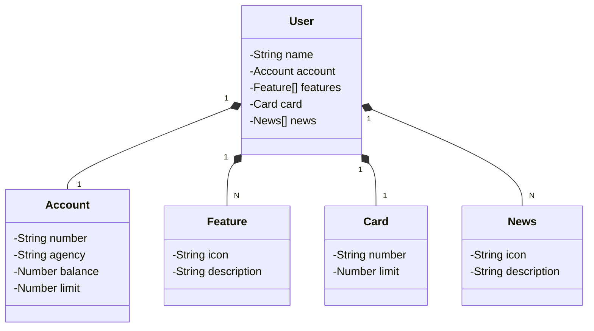

# API de Gerenciamento de Tarefas (inspirada na Santander Dev Week 2023)

API RESTful construída em Java 17 com Spring Boot 3, evoluída a partir do projeto da Santander Dev Week 2023 para um novo domínio: **tarefas**.

## Principais Tecnologias
 - **Java 17**: Utilizaremos a versão LTS mais recente do Java para tirar vantagem das últimas inovações que essa linguagem robusta e amplamente utilizada oferece;
 - **Spring Boot 3**: Trabalharemos com a mais nova versão do Spring Boot, que maximiza a produtividade do desenvolvedor por meio de sua poderosa premissa de autoconfiguração;
 - **Spring Data JPA**: Exploraremos como essa ferramenta pode simplificar nossa camada de acesso aos dados, facilitando a integração com bancos de dados SQL;
 - **OpenAPI (Swagger)**: Vamos criar uma documentação de API eficaz e fácil de entender usando a OpenAPI (Swagger), perfeitamente alinhada com a alta produtividade que o Spring Boot oferece;
 - **Railway**: facilita o deploy e monitoramento de nossas soluções na nuvem, além de oferecer diversos bancos de dados como serviço e pipelines de CI/CD.

## [Link do Figma](https://www.figma.com/file/0ZsjwjsYlYd3timxqMWlbj/SANTANDER---Projeto-Web%2FMobile?type=design&node-id=1421%3A432&mode=design&t=6dPQuerScEQH0zAn-1)

O Figma foi utilizado para a abstração do domínio desta API, sendo útil na análise e projeto da solução.

## Diagrama de Classes (Domínio original da API)



## Documentação da API (Swagger)

### Swagger local

Assim que a aplicação sobe, a interface do Swagger fica disponível em:

- `http://localhost:8080/swagger-ui.html`

> Para este desafio, o foco é na nova API de tarefas exposta em `/tasks`.

### Endpoints principais (`/tasks`)

Aqui eu consolidei os endpoints que implementei para o domínio de tarefas:

- `GET /tasks`  
  Retorna a lista de todas as tarefas cadastradas.

- `GET /tasks/{id}`  
  Busca uma tarefa específica pelo identificador.

- `POST /tasks`  
  Cria uma nova tarefa.

  Exemplo de payload:

  ```json
  {
    "title": "Estudar Spring Boot 3",
    "description": "Revisar anotações principais e boas práticas",
    "dueDate": "2026-04-01",
    "priority": 3,
    "status": "PENDING"
  }
  ```

- `PUT /tasks/{id}`  
  Atualiza uma tarefa existente.  
  Aqui eu segui a boa prática de usar o `id` da URL como fonte de verdade e validá-lo no service.

- `DELETE /tasks/{id}`  
  Remove uma tarefa existente.

### Regras de negócio e validações

Durante a implementação eu tomei algumas decisões para deixar o domínio de tarefas mais consistente:

- **Validações no modelo (`Task`)**  
  - `title` não pode ser vazio;  
  - `dueDate` deve ser hoje ou futuro;  
  - `priority` vai de 1 a 5;  
  - `status` é um `enum` (`PENDING`, `IN_PROGRESS`, `DONE`).
- **Transição de status**  
  No `TaskServiceImpl` eu implementei uma regra simples:
  - `PENDING -> IN_PROGRESS -> DONE`  
  Qualquer outra combinação gera uma `BusinessException`. Fiz isso para mostrar como regras de negócio podem ficar concentradas na camada de serviço.
- **Tratamento global de erros**  
  - `BusinessException` e `NotFoundException` continuam centralizadas no `GlobalExceptionHandler`;  
  - Adicionei o tratamento de `MethodArgumentNotValidException` para retornar `422` com uma mensagem amigável de validação.

## Como executar localmente (perfil dev)

1. Garantir Java 17 instalado.
2. Na raiz do projeto, executar:

   ```bash
   ./gradlew bootRun
   ```

3. A aplicação sobe em `http://localhost:8080` usando H2 em memória (configuração de `application-dev.yml`).
4. Acessar o Swagger em `http://localhost:8080/swagger-ui.html` e testar os endpoints `/tasks`.

> Quando estou estudando, gosto de começar testando pelo Swagger porque ele já me dá o contrato da API e facilita validar se as anotações estão corretas.

## Como configurar no Railway (perfil prd)

No Railway eu reaproveitei a infraestrutura do projeto original, mas ajustei o JPA para gerar o schema das tarefas:

- Arquivo: `src/main/resources/application-prd.yml`
  - `spring.jpa.hibernate.ddl-auto: update`
  - Datasource usando as variáveis de ambiente padrão do Railway:
    - `PGHOST`
    - `PGPORT`
    - `PGDATABASE`
    - `PGUSER`
    - `PGPASSWORD`

### Passos gerais no Railway

1. Criar um novo projeto e adicionar um serviço de banco PostgreSQL.
2. Criar um serviço para a aplicação Java apontando para este repositório.
3. Configurar as variáveis de ambiente do banco com os valores fornecidos pelo próprio Railway.
4. Definir o profile ativo:

   - `SPRING_PROFILES_ACTIVE=prd`

5. Deployar e acompanhar os logs.  
   Sempre que eu vejo erro de conexão ou de schema, a primeira coisa que faço é verificar:
   - se as variáveis de ambiente estão corretas;  
   - se o profile (`prd`) está realmente ativo;  
   - se o `ddl-auto` está compatível com o estado do banco.

Esta API foi pensada como base para estudo, então eu adaptei o domínio para tarefas justamente para exercitar o que aprendi em Spring Boot 3, JPA, validações, tratamento global de erros e deploy no Railway.

### IMPORTANTE

Aos interessados no desenvolvimento da tela inicial do App do Santander (Figma) em Angular, Android, iOS ou Flutter... Caso a URL produtiva não esteja mais disponível, deixamos um Backup no GitHub Pages, é só dar um GET lá 😘
- URL de Produção: https://sdw-2023-prd.up.railway.app/users/1
- Mock (Backup): https://digitalinnovationone.github.io/santander-dev-week-2023-api/mocks/find_one.json
